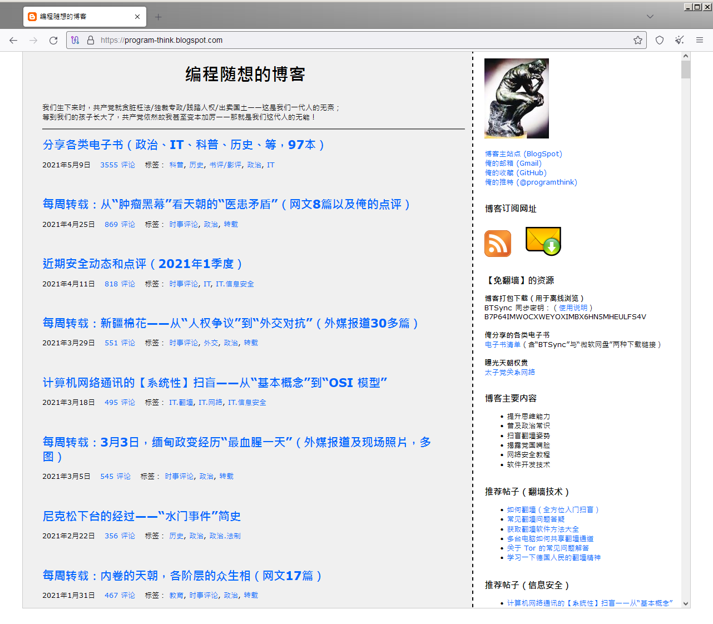
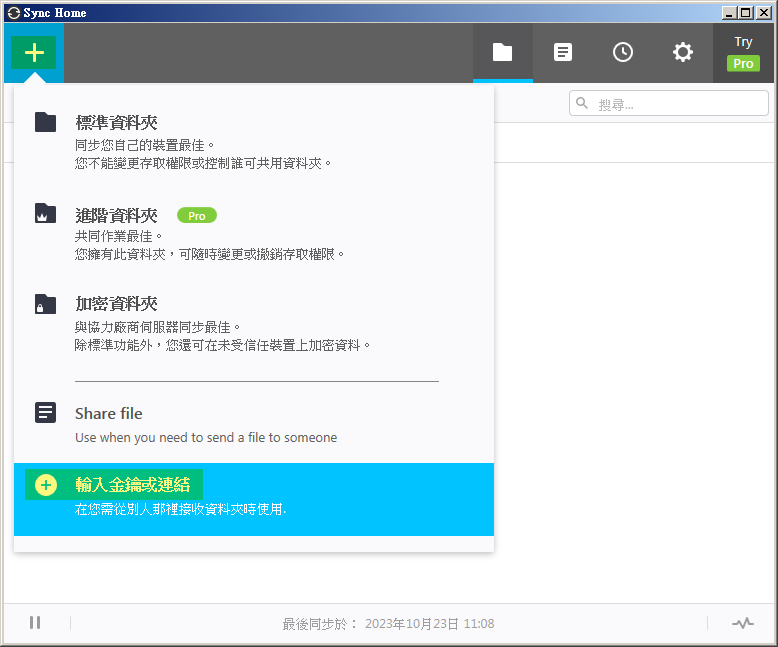
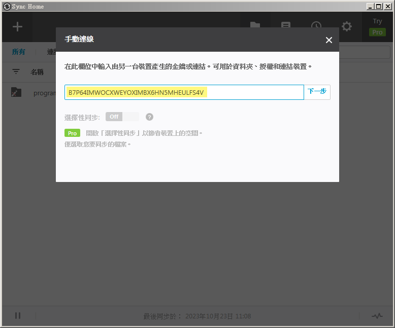
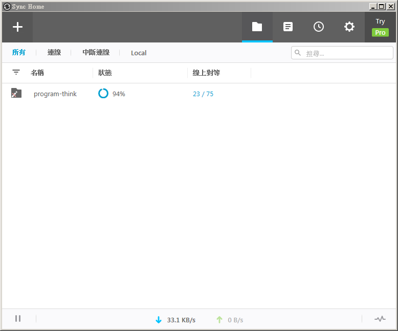
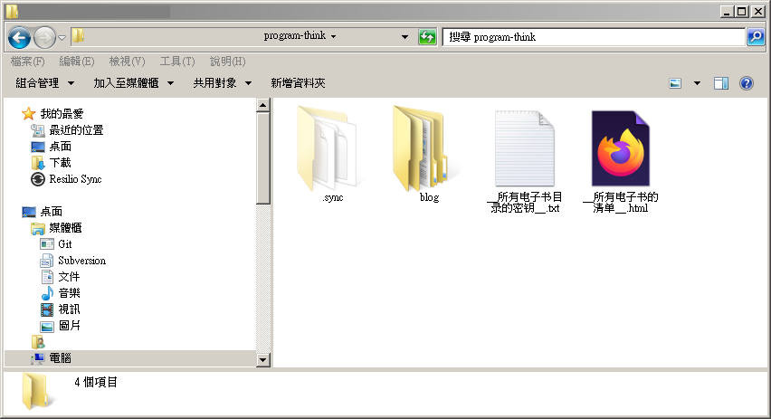
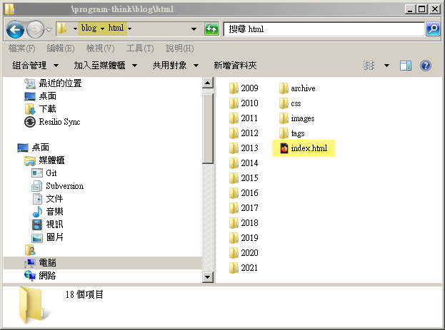

# 「編程隨想」的 blog 備份

*"如果一個政權可以被事實和知識顛覆，那它一定是犯罪組織"*

[编程随想的博客](https://program-think.blogspot.com/)最後一篇文章發布於 2021 年 5 月 9 日。兩天後 2021 年 5 月 10 日[阮曉寰](https://zh.wikipedia.org/wiki/%E7%B7%A8%E7%A8%8B%E9%9A%A8%E6%83%B3)就在上海家中被中國共產黨以煽動顛覆國家政權罪逮捕。

目前提供的備份進度至 2021 年 4 月 11 日。

## 參考資源

如果您還沒聽過「編程隨想」，可以從下面這幾個參考連結開始。

* Youtube
	* [不用微信、支付寶，在上海翻牆反共12年、連老婆都隱瞞的「編程隨想」，最後是怎麼落網的？《 左邊鄰居觀察日記 》EP 093｜志祺七七](https://youtu.be/onr-pqWS8oo)
	* [被消失的中國天才工程師｜百靈果NEWS 精華](https://youtu.be/Q6CU7e7RA1w)
* [从阮晓寰到“编程随想”：一个普通公民和“极客”如何成了“国家的敌人”？](https://ngocn2.org/article/2023-03-29-program-think-enemy-of-the-state/)
* 推薦神作
	* [为啥朝廷总抓不到俺——十年反党活动的安全经验汇总](https://program-think.blogspot.com/2019/01/Security-Guide-for-Political-Activists.html) (编程随想)

## 下載方式

如果想自己下載，可使用 Resilio-Sync（前身是 BitTorrent-Sync / BTSync）。

輸入金鑰 `B7P64IMWOCXWEYOXIMBX6HN5MHEULFS4V`

然後等待同步完成即可。

資料夾內容

點開 index.html 就可以離線看文章了

